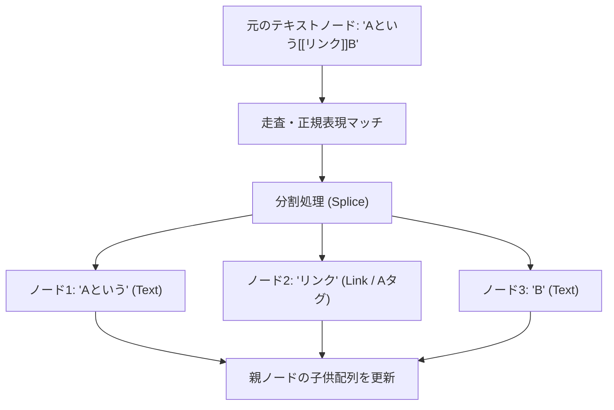

`src/lib/wikilinks.ts` に実装されている `remarkWikiLinks` は、Markdown/MDX 構文内に記述された `[[ページ名]]` や `[[ページ名#アンカー|表示テキスト]]` という WikiLink 表記を解析し、HTML のリンク（Aタグ）を表す構文木ノードに変換するカスタムの Remark プラグインです。

---

## 1. 構文のパースと正規表現

WikiLink の抽出および解析は、以下の正規表現パターン（`WIKILINK_PATTERN_SOURCE`）に基づいて実行されます。

```typescript
const WIKILINK_PATTERN_SOURCE = '\\[\\[([^\\]|#]+)(?:#([^\\]|]*))?(?:\\|([^\\]]*))?\\]\\]';
```

この正規表現は `[[` と `]]` で囲まれた文字列をマッチングし、以下の3つのグループをキャプチャします。
1. **リンク先の文字列** (例: `ページ名` または `フォルダ/ページ名`)
2. **アンカー (#)** (オプション、例: `セクション名`)
3. **表示テキスト (|)** (オプション、例: `カスタム表示ラベル`)

---

## 2. AST (抽象構文木) の走査とノードの動的置換

プラグインは、Markdown が HTML に変換される前の中間状態である **mdast (Markdown Abstract Syntax Tree)** の段階で動作します。

### visit を使った走査
`unist-util-visit` ライブラリの `visit` 関数を使用し、構文木内のすべての **'text'（テキスト）** ノードを走査します。

```typescript
visit(tree, 'text', (node: any, index: number | undefined, parent: any) => {
    // 処理ロジック
});
```

### ノードの分割と置換フロー
1つのテキストノードに WikiLink が含まれている場合、元のテキストノードをそのまま書き換えるのではなく、**「リンク前のテキスト」「リンク用のノード」「リンク後のテキスト」**に細かく分割（スプリット）し、親ノードの子供リスト内で元のノードを複数の新しいノード群で置換します。



置換には配列操作関数 `parent.children.splice(index, 1, ...newNodes)` が使われます。
置換を行った後、新しく追加されたテキストノードに対して再び走査が走って無限ループになるのを防ぐため、`return [SKIP, index + newNodes.length]` を返して走査インデックスを進めます。

---

## 3. ロケール別フォールバックと存在判定

リンク先となる Astro ページの生成先 URL を組み立てる際、単一のファイル名から多言語対応（i18n）を考慮して正しいリンク先ロケールを判別します。

1. **ベーススラッグの逆引き**:
   `resolveSlug(pageName, slugMap)` により、ページタイトルやエイリアスから一意の物理スラッグを割り出します。
2. **現在ロケールでの存在チェック**:
   現在表示中のロケールディレクトリ（例: `/ja/`）配下に該当の物理スラッグが存在するかを `existingSlugs`（公開済みスラッグセット）から調べます。存在すれば、その言語のURLをリンク先に指定します。
3. **デフォルトロケールへのフォールバック**:
   現在ロケールにページが存在しない場合、デフォルトロケール（例: `/ja/`）に該当ページがあるか調べます。あればデフォルトロケール版へのリンクを生成します。これにより、翻訳が完了していないドキュメントもデッドリンクにならず、デフォルト言語で読み進めることができます。

---

## 4. デッドリンク (リンク切れ) のビジュアル表現

`remarkWikiLinks` は、リンク先のページが自言語にもデフォルト言語にも存在しない場合でも、Aタグへの変換処理を実行します。
その際、リンクが切れていることを表すために、生成するリンクノードの HTML 属性 (`class`) に **`wikilink-missing`** クラスを動的に付与します。

```typescript
newNodes.push({
    type: 'link',
    url: href,
    data: {
        hProperties: {
            class: exists ? 'wikilink' : 'wikilink wikilink-missing',
            'data-page': baseSlug,
        },
    },
    // ...
});
```

### スタイリングとの連携
この `wikilink-missing` クラスが付与された A タグは、グローバル CSS (`src/styles/global.css`) で定義されているスタイルルールによって、**「破線付きの赤文字」**などで強調表示され、執筆者に対して新しいページの作成を促すビジュアルフィードバックを提供します。
