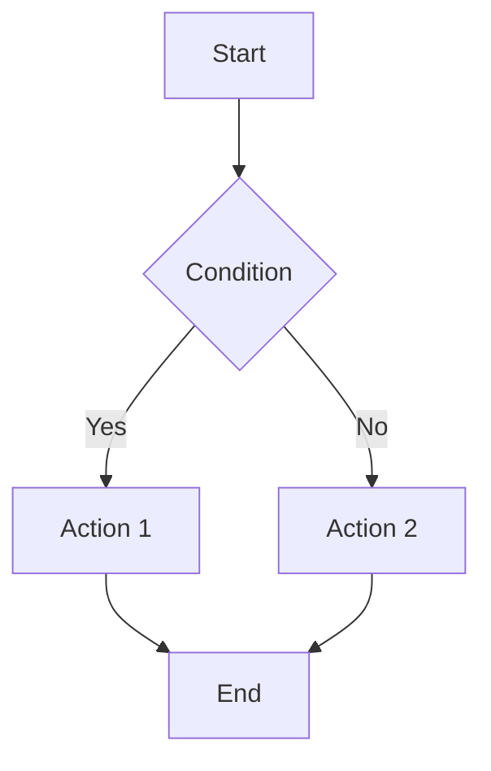
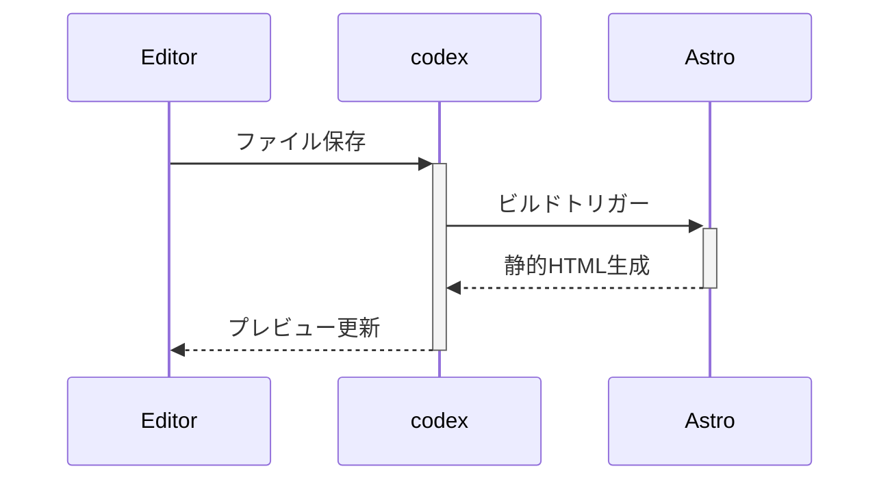

## セットアップ

```bash
# クローン後、依存関係をインストール
npm install

# 開発サーバー起動（http://localhost:4321）
npm run dev

# 本番ビルド（検索インデックスも同時生成）
npm run build

# ビルド結果のプレビュー
npm run preview
```

## ページの作成

新しいページを作成するには、`src/content/wiki/ja/` ディレクトリに `.mdx` または `.md` ファイルを追加します。

例: `src/content/wiki/ja/my-page.mdx`

```mdx
---
title: ページタイトル
description: ページの説明
tags:
  - タグ1
  - タグ2
date: 2026-06-16
updated: 2026-06-18
---

# 見出し

テキストコンテンツ...
```

ページはビルド時（または開発サーバー起動時）に自動的にスキャンされ、検索インデックスに追加されます。

### フロントマター

| フィールド | 説明 | 必須 |
| --- | --- | --- |
| `title` | ページのタイトル | ○ |
| `description` | ページの説明 | ○ |
| `tags` | タグの配列（検索やグラフのグループ分けに使用） | △ |
| `date` | 作成日 (YYYY-MM-DD) | ○ |
| `updated` | 更新日 (YYYY-MM-DD) | △ |
| `draft` | 下書きフラグ（`true` にするとビルドや検索から除外されます） | △ |
| `hidden` | 非表示フラグ（`true` にすると検索やグラフから非表示になります） | △ |
| `showBacklinks` | バックリンクをページ末尾に表示するかどうか（デフォルト: `true`） | △ |

## ウィキリンク (WikiLink)

```markdown
[[ページタイトル]]　→ ページタイトルでリンク
[[ページタイトル|表示テキスト]] → 表示テキストでリンク
[[ページタイトル#セクション名]] → ページ内の特定セクションにリンク
[[サブディレクトリ/ページ名]] → サブディレクトリ内のページにリンク
```

リンク先のページが自言語（例: 日本語）に存在しない場合、デフォルト言語（英語）の同一ページを自動的に検索してフォールバックリンクします。
それでもリンク先が存在しない場合は、リンク切れ（デッドリンク）として赤字（`wikilink-missing`）で表示されます。

## ディレクトリ構成

コンテンツは `src/content/wiki/[locale]/` 配下のリソースとして管理されます。
サブディレクトリでさらに階層化して整理することもできます。

```text
src/content/wiki/
├── ja/                      → 日本語 (ルート)
│   ├── index.mdx            → /ja/wiki/
│   ├── getting-started.mdx  → /ja/wiki/getting-started
│   └── recipes/
│       └── pasta.mdx        → /ja/wiki/recipes/pasta
└── en/                      → 英語
    └── index.mdx            → /en/wiki/
```

## サイドバーのカスタマイズ

`src/layouts/sidebar.config.ts` を編集してサイドバーのナビゲーション構成を変更できます。

```ts
// 手動で固定リンクを並べる場合 (items 配列を定義)
{
  titleKey: 'sidebar.quickLinks', // i18nの翻訳キー
  icon: 'fa-solid fa-bolt',       // Font Awesomeのアイコン
  collapsed: false,               // 初期状態で展開
  items: [
    { i18nKey: 'sidebar.home', href: '/', icon: 'fa-solid fa-house' },
    { slug: 'document/getting-started', icon: 'fa-solid fa-book' } // スラッグ指定時は自動でタイトル解決
  ],
},

// カテゴリを指定してWikiページを自動収集する場合 (items を省略し category を指定)
{
  titleKey: 'sidebar.sampleAuto',
  icon: 'fa-solid fa-book',
  collapsed: true,
  category: 'sample',     // src/content/wiki/ja/sample/ 配下を自動収集
  autoSort: 'title',      // 'title' | 'order' | 'date' | 'updated' から並び順を指定
},
```

## GitHub Pages への公開

1. GitHubリポジトリを作成し、コードを push します。
2. **Settings → Pages → Source** で `GitHub Actions` を選択します。
3. リポジトリ用のサブパス（例: `/repo-name`）を使用する場合は、環境変数に以下を設定します：
    - `SITE_URL` : `https://username.github.io`
    - `BASE_PATH` : `/repo-name`
4. `main` ブランチに push すると自動デプロイワークフローが起動します。

## 数式

インライン数式: $E = mc^2$

ブロック数式:

$$
\int_{-\infty}^{\infty} e^{-x^2} dx = \sqrt{\pi}
$$

## Mermaid ダイアグラム





## カスタムコンポーネント

MDX内では、様々な専用コンポーネント（警告ボックス、タブレイアウトなど）をインポートして利用できます。
コンポーネントの実体は `src/components/mdx/` 配下に配置されていますが、`tsconfig.json` のパスエイリアス設定により、`@templates/*` から簡単にインポートすることができます。

例:
```mdx
import Note from '@templates/Note.astro';

<Note>ここに内容を書きます。</Note>
```

詳細な各コンポーネントの使い方については、[[document/custom-components|カスタムコンポーネントガイド]] を参照してください。